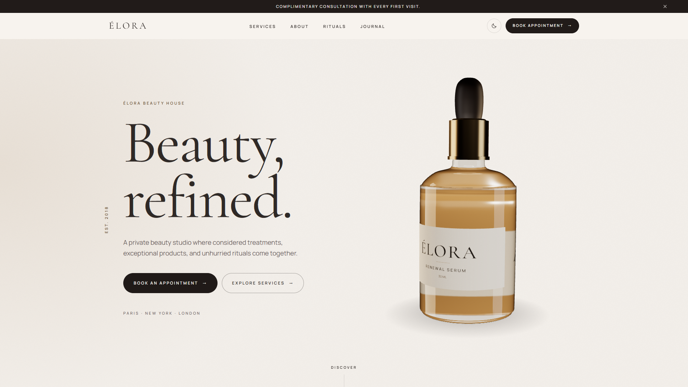
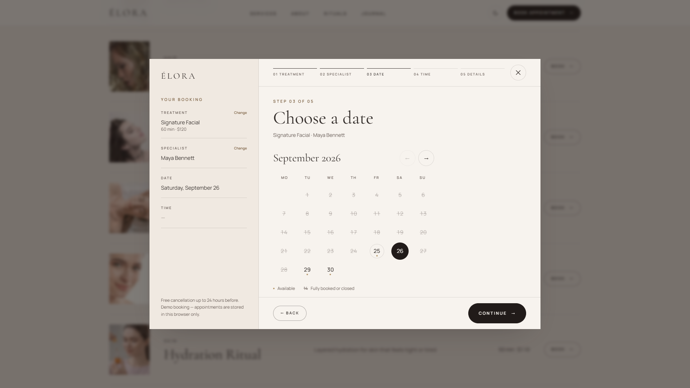
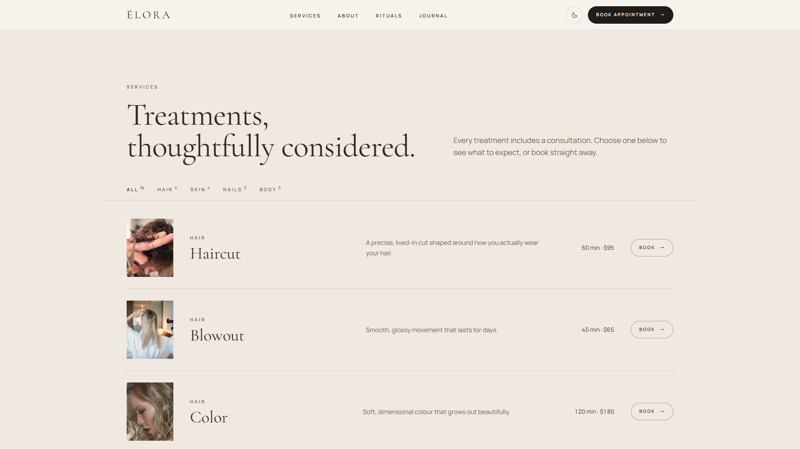
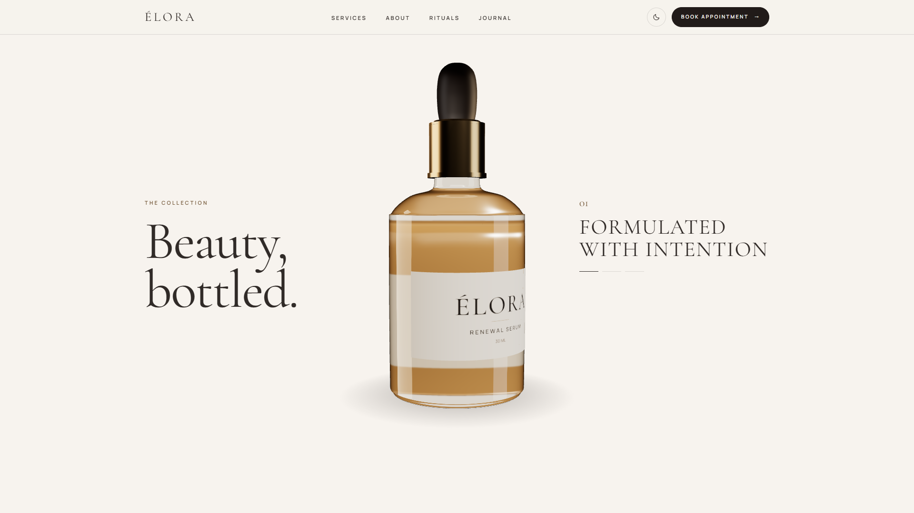
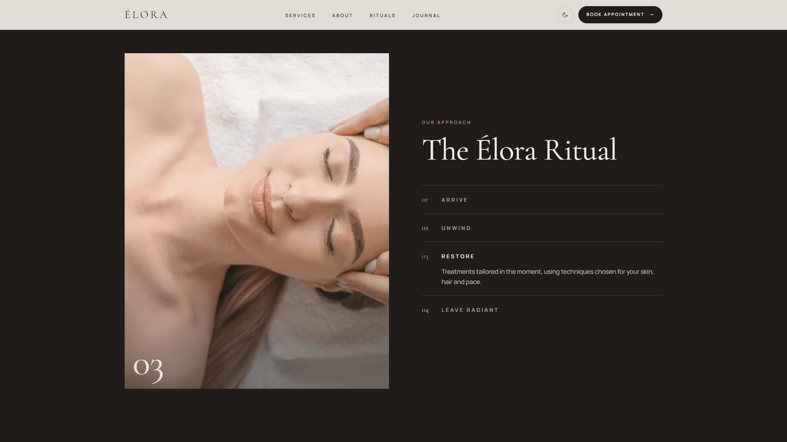
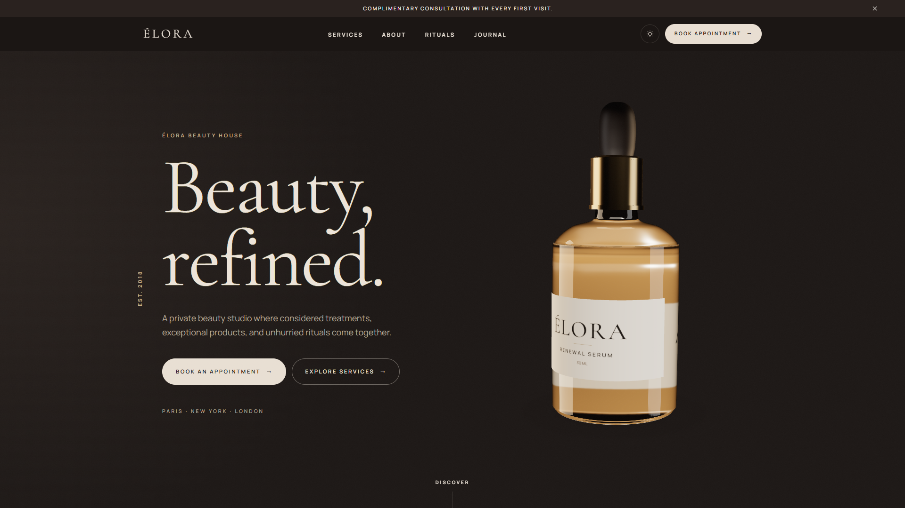

# ÉLORA — Luxury Beauty Salon Website Template

A luxury beauty-salon website **template** with a **real, working booking flow** and a procedural 3D serum bottle, designed to be re-skinned for any salon, spa or beauty studio.

**Live demo:** https://elora-muad1.vercel.app
**Get the source:** https://muadme.gumroad.com/l/phdwvf

## Highlights

- **Multi-step booking engine**: treatment → specialist → date → time → details → confirmation.
  - Validation, loading, error and no-availability states at every step.
  - A keyboard-accessible calendar.
  - "Add to calendar" (.ics) and a printable confirmation.
  - The UI talks to just two functions, so connecting a real booking provider is one file.
- **3D serum bottle, built in code**: no third-party model to license. It turns with scroll, leans slightly toward the cursor, and returns in a pinned "Beauty, bottled." product scene.
- **Never an empty box**: live WebGL on desktop; pre-rendered stills on phones, weak devices, browsers without WebGL and for reduced-motion users.
- **Everything a salon site needs**:
  - service filters and detail modals
  - a pinned 4-step ritual
  - before/after slider
  - masonry gallery with lightbox
  - team profiles
  - journal
  - FAQ
  - location and contact
  - newsletter
- **Dark mode**, mobile-first layouts with a sticky booking bar, accessible modals, and `BeautySalon` + FAQ structured data.
- **Rebrand from config**: brand, services, prices, team, hours and booking rules live in a few documented files.

## Stack

React 19 · TypeScript · Vite · Tailwind CSS v4 · three.js / React Three Fiber

## Gallery

| | |
|---|---|
|  |  |
|  |  |
|  | |

## This repository

This repo is a **showcase**: screenshots and a live demo link, not the source. The full source, with setup docs, the rebranding guide and the booking-provider guide, is sold on Gumroad:
**https://muadme.gumroad.com/l/phdwvf**

Demo content (brand, prices, reviews, staff, availability) is fictional. Demo photography is CC0.

## More templates

- [NEXFORM](https://github.com/Muaddd1/NEXFORM) — futuristic personal-trainer template with a 3D athlete, a quiz, a body map and a real booking flow ([demo](https://nexform-muad1.vercel.app))
- [FADEHOUSE](https://github.com/Muaddd1/FADEHOUSE) — premium barbershop template with a real booking flow and a 3D clipper built in code ([demo](https://fadehouse-muad1.vercel.app))
- [VELLUTO](https://github.com/Muaddd1/VELLUTO) — cinematic 3D coffee-brand template ([demo](https://velluto-muad1.vercel.app))
- [AURELIA](https://github.com/Muaddd1/AURELIA) — luxury e-commerce React template ([demo](https://aurelia-template-phi.vercel.app))
- [AURUM](https://github.com/Muaddd1/AURUM) — luxury gold jewelry template with a live gold price calculator and Arabic RTL ([demo](https://aurum-template-muad1.vercel.app))
- [VANTA](https://github.com/Muaddd1/VANTA) — premium digital-product storefront ([demo](https://vanta-creator-os.vercel.app))
- [GOLDEN CRUST](https://github.com/Muaddd1/GOLDEN-CRUST) — pizza restaurant template with a 3D pizza hero ([demo](https://golden-crust-muad1.vercel.app))
